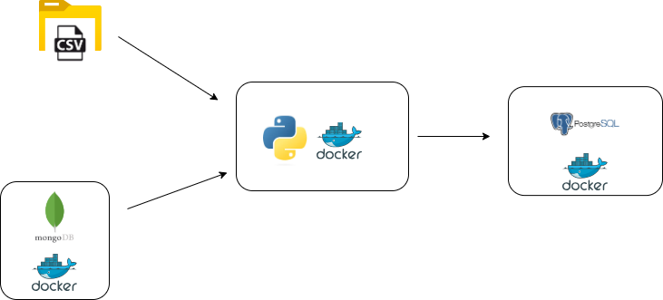
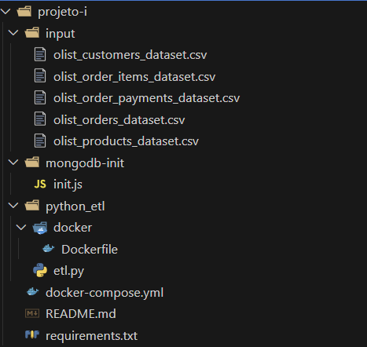

# 🚚 Data Warehouse para Insights de Pedidos - Olist

Este projeto tem como objetivo construir um Data Warehouse para análise de pedidos da empresa Olist, baseado em um modelo dimensional. Ele foca em dados de vendas, localização dos clientes, categorias de produtos, formas de pagamento e status dos pedidos.

---

## 🔗 Fontes dos Dados

- [Brazilian E-Commerce Public Dataset by Olist - KAGGLE](https://www.kaggle.com/datasets/olistbr/brazilian-ecommerce?select=olist_order_payments_dataset.csv)  

---

## 📐 Modelagem Dimensional

O Data Warehouse foi estruturado seguindo o modelo dimensional clássico, com tabelas de dimensão para status do pedido, cliente, produto, forma de pagamento, tempo e uma tabela fato central para pedidos.

<p align="center">
  
</p>

---

## 🔧 Arquitetura da Aplicação

A aplicação foi desenvolvida utilizando as seguintes tecnologias:

- Python (Pandas, SQLAlchemy, psycopg2)
- PostgreSQL (Data Warehouse)
- MongoDB (Armazenamento de reviews de clientes)
- Docker (Orquestração de containers e ambiente isolado)

<p align="center">
  
</p>

---

## 📁 Estrutura do Projeto

A estrutura recomendada para execução:

<p align="center">
  
</p>

---

## 📋 Pré-requisitos

- Python 3.8+
- Docker e Docker Compose instalados
- Pacotes Python listados em `requirements.txt` (instale com: `pip install -r requirements.txt`)
- Dados originais baixados e disponíveis na pasta `./input`:
  - (https://www.kaggle.com/datasets/olistbr/brazilian-ecommerce?select=olist_customers_dataset.csv) 
  - (https://www.kaggle.com/datasets/olistbr/brazilian-ecommerce?select=olist_order_items_dataset.csv) 
  - (https://www.kaggle.com/datasets/olistbr/brazilian-ecommerce?select=olist_order_payments_dataset.csv) 
  - (https://www.kaggle.com/datasets/olistbr/brazilian-ecommerce?select=olist_orders_dataset.csv) 
  - (https://www.kaggle.com/datasets/olistbr/brazilian-ecommerce?select=olist_products_dataset.csv) 

---

## ⚙️ Como executar

1. Clone o repositório
   
2. Execute os comandos:
```bash
  pip install -r requirements.txt
  docker compose build
  docker compose up
```

3. A aplicação irá criar as tabelas no banco, fazer o ETL dos dados CSV e MongoDB para o Data Warehouse e popular as tabelas dimensionais e fato.

4. Logs da execução estarão disponíveis no terminal.

5. Para acessar o Data Warehouse:
   ```bash
   docker ps
   ```
   obtenha o id ou nome do container

    ```bash
    docker exec -it <nome_do_container_ou_id> bash
    psql -U f_compass -d pd_dw
    ```
     -U: usuário que irá se conectar no banco (declarado no docker-compose.yaml)
   
     -d: base de dados a ser conectada
##### ⚠️ Observação: em um contexto de aplicação real em produção, as informações de credenciais do banco de dados postgres e mongodb não seriam versionadas e sim armazenadas em um arquivo (.env). Por se tratar de um projeto para fins didáticos, não foi usado essa abordagem. Você pode ficar à vontade para inserir outras credenciais no arquivo de orquestração.
  
